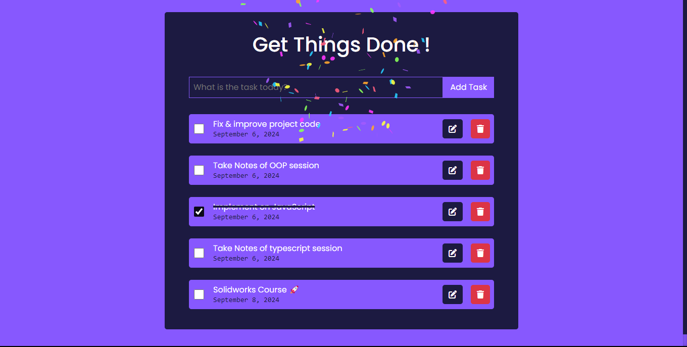
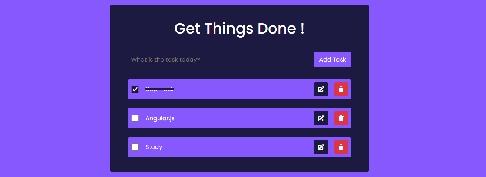

# 📝 Get Things Done! - A Feature-Rich Todo App

## 🌟 Features

- ✅ Add, edit, and delete tasks
- 🗓️ Automatic date stamping for each task
- 💾 Local storage for persistent data
- 🎉 Confetti celebration when all tasks are completed
- 🔊 Sound effects for task completion and addition
- 🔒 HTML escaping for secure task input
- 📱 Responsive design for mobile and desktop

## 🛠️ Technologies Used

- HTML5
- CSS3 (with Bootstrap for styling)
- JavaScript (ES6+)
- Local Storage API
- Canvas Confetti library

## 🚀 Quick Start

1. Clone the repository
2. Open `index.html` in your browser
3. Start adding tasks and getting things done!

## 🎨 User Interface

- Clean and intuitive design
- Bootstrap-powered modals for task editing
- Font Awesome icons for enhanced visual appeal
- Toast notifications for user feedback

## 🔧 Core Functionality

### Task Management
- Add tasks with a simple input field
- Edit tasks through a modal dialog
- Delete tasks with a single click
- Mark tasks as complete with checkboxes

### Data Persistence
- Tasks are automatically saved to local storage
- App state is restored on page reload

### Interactive Feedback
- Confetti animation when all tasks are completed
- Custom sound effects for task addition and completion
- Multiple rapid check sounds when all tasks are marked complete

## 🔐 Security
- HTML escaping to prevent XSS attacks from user input

## 🎵 Audio Features
- `check.wav` plays when a task is marked complete
- `add.mp3` plays when a new task is added
- Multiple check sounds play in quick succession for a celebratory effect

## 🌈 Future Enhancements
- Task categories or tags
- Due dates and reminders
- Task priority levels
- Dark mode toggle
- Cloud sync for cross-device usage

## 👨‍💻 Contributing
Feel free to fork this project and submit pull requests with new features or improvements!

## 📄 License
This project is open source and available under the [MIT License](LICENSE).

---

Get organized, stay productive, and celebrate your accomplishments with Get Things Done! 🎊